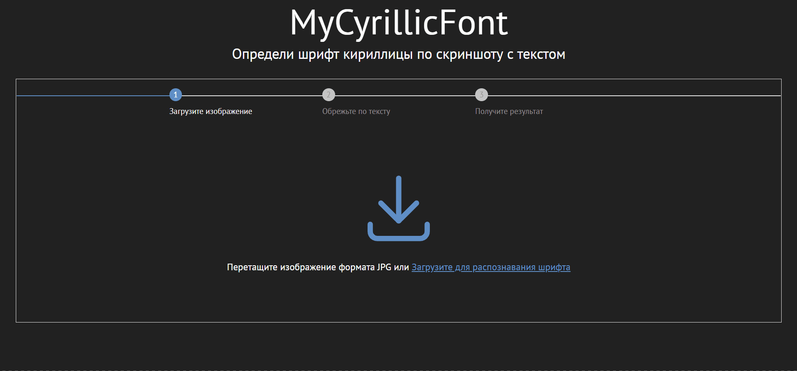

## Портфолио

---

### Распознавание шрифтов кириллицы на изображениях

Задача определения названия шрифта, которым написан текст на изображении. В данном проекте была дообучена нейронная сеть GoogleNet на сгенерированных изображениях с русским текстом

  

[View code on Github](https://github.com/NastyaGribanova/My_cyrillic_font)
---
[Project 2 Title](/pdf/sample_presentation.pdf)

---
[Project 3 Title](http://example.com/)

---

### Category Name 2

- [Project 1 Title](http://example.com/)
- [Project 2 Title](http://example.com/)
- [Project 3 Title](http://example.com/)
- [Project 4 Title](http://example.com/)
- [Project 5 Title](http://example.com/)

---

---

Page template forked from <a href="https://github.com/evanca/quick-portfolio">evanca</a>

<!-- Remove above link if you don't want to attibute -->
